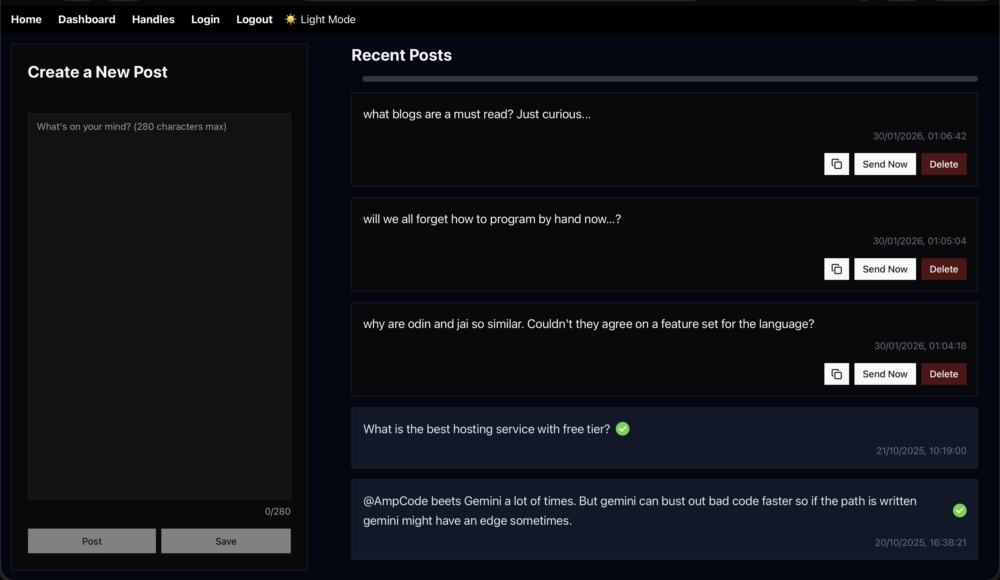

# BridBrain




This is a project to send very important and life changing messages to twitter.com (formally known as
X.com). First and foremost this is a project for me to (really) learn Effect. I tried it before but
I haven't build something _real_ with it jet.

You only have to provide your API key as env var and the messages can flow in when you have a
creative spree you can pre-write the messages and also send them on demand.

## Features/Backlog

### Effect Backend (focus)

- [x] make a webserver with effect
- [x] send a message to the twitter api
- [x] create messages and save them in the database
- [ ] send the first/random message in the message list on a schedule
- [ ] send the progress on the next scheduled message
- [ ] save the messages sent and not sent in a SQLite database for later reference with the message
      id
  - [x] sql service
  - [x] create the schema
  - [x] test the query and execute functionality
- [ ] read stats on an already send message

### Vite Frontend

- [x] proxy webserver in the frontend
- [x] list messages on the frontend
- [x] send messages directly
- [ ] send saved messages on demand
- [ ] interact with the message list in a web interface (delete/sent/refresh/edit)
- [ ] see the progress on the next scheduled message

## Technical considerations

### SQLite

I personally use SQLite a lot because my apps do not need the scale of a bigger non-file database
and it is easy to integrate (also easy to change).

### Tweet Data Type

```js
{
  id: number; // for internal reference
  twitterID: string; // for later reference with the api
  text: string;
  ...
}
```

### Use Vite for the frontend

- pros
  - I can write it really fast and the backend can be proxied
  - I can write react this enables multiple routes and complex uis
  - it is very extensible
- cons
  - features do not need it right now
  - you can get away with only providing plain js from the server
  - the js is not bundled and is not minified
- result: I am using vite with react because of the familiarity and because I don't want to struggle
  later with the problems that can come with JS only frontend no types and no bundling. I want to
  focus on the effect backend which is the interesting part with optional websockets for progress on
  when to send the next tweet.

### Goal

I want to find out whether effect is something that should be used on the backend for apps like this
where performance is not important, you can profit from the familiarity with TypeScript and you can
improve availability of the app with the improved error handling of the effect library.

## Contributions

If someone reads this and wants to contribute... You are welcome give it a shot this is a good
first contribution to an open source project :D. Please format the code with biome first, thanks!
